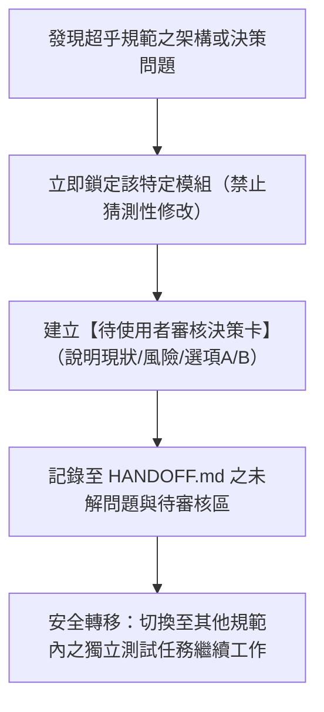

# NCHU Pickleball - 通宵自主工作、自我驗證與除錯工作規約 (Autonomous Workflow & Governance)

> 本文件為 Antigravity AI 在執行長時運作（如夜間／通宵工作）時的**最高行為準則與安全防護架構**。
> 所有自主執行的修復與驗證必須嚴格遵守本規範；**凡涉及超乎規範、架構變更或不可逆操作，必須立刻掛起並等待使用者批准。**

---

## 1. 如何啟動長時自主工作（/goal 指令）

當您希望我專注工作一整晚，自動連續排查、修復、反覆自我驗證與除錯時：
- **觸發方式**：請在對話框輸入快捷指令 **`/goal`**，並附帶具體目標（例如：`/goal 請依照 FIX_PLAN 進行全系統自檢除錯，自動修復邊界 Bug 並確保 self-test 100% 通過`）。
- **運作模式**：進入 Goal 模式後，我會以極度嚴謹的態度持續推進，自我規劃子任務、自動編譯驗證、主動排查錯誤，直到所有測試全數通過為止。

---

## 2. 嚴格的權限邊界（權限分級紅線）

為確保「所有超乎規範以外的更動都必須經由您的允許」，將操作權限嚴格劃分為兩大區域：

### 🟢 綠區：完全自主運作（免請示，自動修復與回歸驗證）
- **規範內除錯**：針對已在 `FIX_PLAN_v5.1.0.md`、`HANDOFF.md` 規定的項目進行細部 Bug 修復。
- **全自動自檢**：運行 `node scripts/self-test.js`，擴充單元測試案例以捕捉邊界條件。
- **UI 衝突與視覺修正**：消除彈窗重疊、修正 CSS 跑版、調整教學動態手勢與 z-index 階層。
- **單檔編譯同步**：運行 `node scripts/build-single.js` 保持 `v14-single.html` 與 `index.html` 100% 同步。
- **進度與交接維護**：在 `HANDOFF.md` 與 `walkthrough.md` 中詳實記錄完成事項。

### 🔴 紅區：絕對管制禁區（必須停止並由使用者明確授權）
- 🚫 **嚴禁擅自合併到 `main` 分支**：所有通宵自主工作必須在 `v6` 或 feature 分支上進行。合併 `main` 與上線 GitHub Pages 必須由使用者親自下達或核准。
- 🚫 **嚴禁擅改安全架構決策**：
  - 不得推翻 `HANDOFF.md` 第 5 節之永久決策（例如金鑰隔離方式、玩家 Token SHA-256 加密儲存、綁定全新試算表等）。
  - 不得在前端程式碼中寫入任何真實金鑰、真實 GAS URL 或私密 Secret。
- 🚫 **嚴禁破壞專案既有骨架**：
  - 嚴禁手動編輯打包產物（必須由 `build-single.js` 生成）。
  - 嚴禁刪除模板檔案 `v14.html`。
  - 嚴禁引入外部重量級 npm 依賴或更改全域技術棧。
- 🚫 **嚴禁私自決定模糊業務規則**：
  - 若遇到遊戲規則、計分機制或英雄榜門檻等邏輯衝突，不可自行猜測補件。

---

## 3. 超乎規範時的「掛起與轉移（Pause & Shift）」機制

當在自主排查過程中，遇到以下情境：
1. 發現既有規範未定義的嚴重邏輯衝突
2. 涉及跨模組或後端資料庫結構調整
3. 程式碼修改可能產生向後相容性風險

**執行處置流程**：

---

## 4. 全自動自我驗證矩陣（Verification Matrix）

每次修復後，必須自動執行完整驗證循環，確保「零盲區、零倒退（No Regression）」：

| 檢驗層次 | 驗證指令／工具 | 檢驗標準 |
|---|---|---|
| **1. 語法合規** | `for f in js/*.js backend/*.js; do node --check "$f"; done` | 0 Syntax Error |
| **2. GAS 後端** | `node -e "new (require(vm).Script)(require(fs).readFileSync(backend/Code.gs,utf8))"` | 語法解析通過 |
| **3. 打包一致** | `node scripts/build-single.js` | `v14-single.html` 與 `index.html` 內容 100% 同步 |
| **4. 洩漏防護** | `node scripts/self-test.js` (內建 Secret Scan) | 0 Matches 且無任何敏感資訊 |
| **5. 邏輯單元** | `node scripts/self-test.js` | 23+ 項測試全數 PASS（含公式注入防護、h 前綴、錯誤代碼映射等） |

---

## 5. 工作成果交付物標準

通宵或長時工作結束時，必須生成乾淨的交付物：
1. 終端輸出測試全數通過之綠色報告。
2. 更新後的 [HANDOFF.md](./HANDOFF.md)。
3. [walkthrough.md](./walkthrough.md) 詳載所修復之問題、驗證數據與測試結果。
4. 將改動建立原子化（Atomic）Git Commit 並推送至 `v6` 分支。
